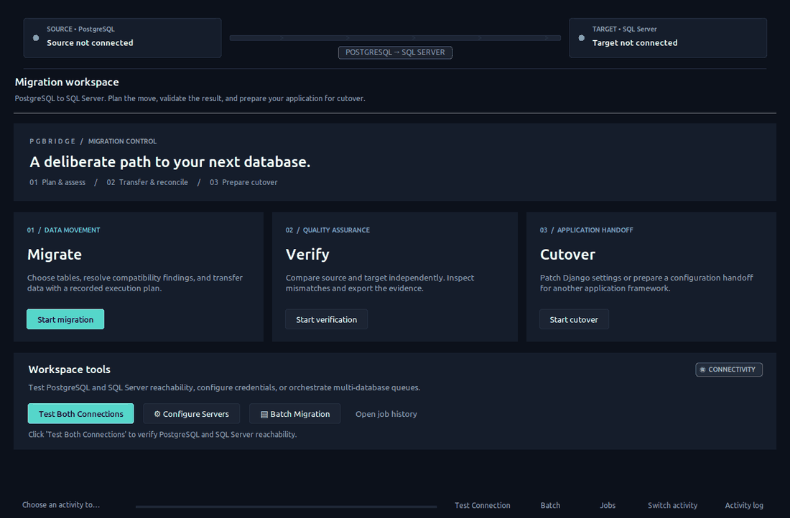
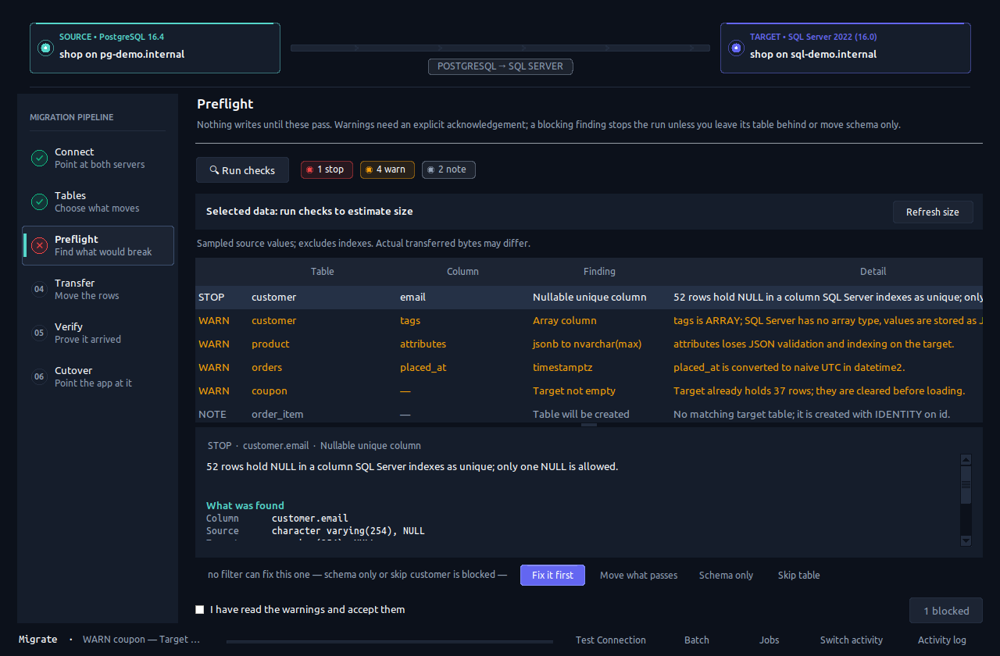

<div align="center">

# pgbridge

### Move a PostgreSQL database to SQL Server without guessing whether it worked.

A free, open-source desktop app that plans the migration, flags type incompatibilities
*before* you copy a row, transfers in resumable batches, and **refuses to call it done
until verification passes**.

[](https://github.com/AzeemQidwai/pgbridge/actions/workflows/tests.yml)


[Quick start](#quick-start) · [Workflow](#migration-workflow) · [Cutover](#application-cutover) · [Operations](#operational-boundaries) · [Development](#development)



<sub>Demo data. Every stage of a migration: connect, choose tables, preflight, transfer, verify, cut over.</sub>

</div>

---

## Why pgbridge?

Most Postgres → SQL Server moves end up as a pile of hand-written scripts, an SSMA
project that doesn't speak PostgreSQL well, or a paid tool. The hard part is never
the copy — it's knowing that `timestamptz`, `jsonb`, arrays, `NUL` bytes, uniqueness
and collation survived. pgbridge makes those risks visible up front and makes
"success" something the tool has to prove.

- **Preflight, not post-mortem** — type, column, and uniqueness risks per table before any write
- **Resumable** — checkpoints are bound to the exact source/target/plan, so a stale one can't be reused by accident
- **Honest verification** — missing tables or zero checked tables fail, they don't pass
- **App cutover included** — patch Django settings, or export handoff templates for SQLAlchemy, EF Core, Spring Boot, and Node
- **No cloud, no account** — runs on your machine, credentials never leave it

<p align="center">
  
  <br><sub>Preflight names the exact column, how each side declares it, and what you can do about it.</sub>
</p>

If pgbridge saves you a weekend, a ⭐ helps other people find it.

## Built for a controlled database move

pgbridge keeps PostgreSQL as the source and SQL Server as the destination.
Its Python engine runs independently of the Tkinter interface, while the desktop
workspace brings connection profiles, table selection, compatibility findings,
transfer progress, verification, and job reports into one place.

| Capability | What you can do |
| :--- | :--- |
| Focused workspace | Start a migration, independent verification, or application cutover |
| Migration planning | Choose schema + data, schema only, or data only; inspect per-table plans |
| Preflight analysis | Review type compatibility, missing columns, uniqueness risks, and target state |
| Controlled transfer | Process batches, pause or stop work, and inspect per-table results |
| Recovery | Resume a matching plan; interrupted tables are cleared and reloaded |
| Verification | Compare row counts and run the available deeper column checks |
| Evidence | Inspect job history and export reports with exclusions and failures |
| Application handoff | Patch Django settings or export framework-specific integration templates |

> **Release status:** production-oriented tooling, not a production certification.
> Qualify it against your organization's database versions, representative data,
> failure scenarios, security controls, and application workloads before a live move.
> This is a batch migration tool; it does not provide continuous replication or CDC.

## Quick start

### Prerequisites

- Python with Tkinter. The current local regression environment uses Python 3.13.
- Network access to the PostgreSQL source and SQL Server target.
- Microsoft ODBC Driver 18 for SQL Server and an ODBC driver manager.
- Database accounts with permissions appropriate to your selected operations.

On Ubuntu, install the OS dependencies:

```bash
sudo apt install python3-tk python3-venv unixodbc
```

Install the SQL Server driver using Microsoft's instructions for your exact
[Linux distribution](https://learn.microsoft.com/en-us/sql/connect/odbc/linux-mac/installing-the-microsoft-odbc-driver-for-sql-server).
On Windows, use Python with Tcl/Tk enabled and the
[Microsoft ODBC driver installer](https://learn.microsoft.com/en-us/sql/connect/odbc/download-odbc-driver-for-sql-server).

Install straight from GitHub with [pipx](https://pipx.pypa.io) and launch:

```bash
pipx install git+https://github.com/AzeemQidwai/pgbridge
pgbridge
```

Or run from a clone:

```bash
git clone https://github.com/AzeemQidwai/pgbridge && cd pgbridge
python3 -m venv .venv && source .venv/bin/activate   # Windows: py -m venv .venv; .venv\Scripts\Activate.ps1
python -m pip install -e .
pgbridge                                             # or: python run.py
```

pgbridge checks required runtime components at startup. Source and target databases
are selected in the workflow, after configuring the server connections. Open a
database dropdown to search by name; matching is case-insensitive. Press Enter
to choose a result or Escape to dismiss the search. New target database names
can still be typed directly into the target field.

## Migration workflow

| Stage | Operator decision | Output |
| :--- | :--- | :--- |
| **1 · Connect** | Configure and test both server connections | Reachable endpoints |
| **2 · Tables** | Select databases, tables, and migration mode | Transfer scope |
| **3 · Preflight** | Resolve blockers and review warnings and exclusions | Explicit per-table plan |
| **4 · Transfer** | Review clearing, recovery, and row-error policies | Table results and checkpoint |
| **5 · Verify** | Inspect mismatches and planned omissions | Verification evidence |
| **6 · Cutover** | Prepare configuration and validate the application | Application handoff |

A table can follow the run mode, migrate an explicitly reduced selection, move
schema only, or be skipped. A reduced selection is not full migration: review
excluded rows and columns in the report before accepting the result.

Standalone **Verify** reads an existing database pair. **Batch** queues multiple
databases. **Job history** retains execution details and exportable reports.

### Data-size estimate

Preflight estimates the selected row data in automatic B / KB / MB / GB / TB units.
It samples up to 1,000 rows per data table, scales source-value lengths by the
discovered row count, and respects filters and excluded columns. Schema-only and
skipped tables contribute no row data. After changing a plan, use **Refresh size**.

The separate **Database on disk** figure includes indexes and unselected data.
The selected-data estimate is not exact network traffic or required SQL Server disk
space: encoding, conversion, sampling, and source changes can affect the result.

### Recovery contract

Checkpoints are written through a temporary file, flushed, and atomically replaced.
New checkpoints use separate filenames for each endpoint pair. Resume is an explicit
choice. They bind recovery to source host/port/database/schema, target
server/database/schema, migration mode, selected columns, filters, and table plans.
A mismatched or older checkpoint is refused before database work begins.

Completed tables retain their results across resume. Interrupted tables are
**cleared and loaded again**, even when the normal clearing option is disabled.
Recovery is per table, not a continuation from the last batch. Review target
contents before starting a fresh run after a checkpoint refusal.

Keep one active process per output directory. Checkpoint files are not a
multi-process lock or a distributed job queue.

## Application cutover

Framework support belongs at the configuration and validation boundary. Changing
a connection string does not translate ORM migrations, PostgreSQL-specific SQL,
queries, transaction semantics, or application behavior.

| Application | Available workflow | Validation responsibility |
| :--- | :--- | :--- |
| **Django** | Preview and patch `DATABASES`; back up settings; optional `.env`; package checks; app connection probe | Rehearse settings loading and business workflows |
| **SQLAlchemy / FastAPI / Flask** | Export an environment-based SQLAlchemy configuration handoff | Integrate session lifecycle and validate SQL/ORM behavior |
| **ASP.NET Core / EF Core** | Export provider registration and secret configuration guidance | Review provider-specific migrations and application tests |
| **Spring Boot / JDBC** | Export datasource properties and JDBC guidance | Validate schema, transactions, and application queries |
| **Node.js / Express** | Export a `node-mssql` pool configuration | Integrate pool lifecycle and test critical paths |

Open **Cutover → Framework handoff** to preview and export a Markdown document.
Exports contain no database password or username, do not alter application files,
and do not mark cutover complete. Templates use SQL authentication and validated
TLS; integrated authentication requires provider-specific setup.

Django remains the only automatic patch adapter. Settings are syntax-checked before
replacement. The UI attempts to restore settings if the subsequent `.env` write
fails. The two files are not an atomic transaction across a process crash: retain
backups and inspect both files after interruption. Python syntax validation also
does not establish that application imports or startup will succeed.

Provider references: [SQLAlchemy](https://docs.sqlalchemy.org/en/20/dialects/mssql.html),
[EF Core](https://learn.microsoft.com/en-us/ef/core/providers/sql-server/),
[Spring Boot](https://docs.spring.io/spring-boot/reference/data/sql.html),
[node-mssql](https://github.com/tediousjs/node-mssql).

## Operational boundaries

Before a live cutover:

1. Rehearse with a restored source and representative application traffic.
2. Review generated DDL. Do not assume automatic conversion of functions, triggers,
   views, extensions, roles, permissions, or PostgreSQL-specific behavior.
3. Back up both databases and application configuration; test restoration.
4. Stop source writes and workers before the final transfer. Independent table reads
   do not constitute a consistent database-wide snapshot while writes continue.
5. Verify data, reconcile exclusions, and obtain the required internal release approval.
6. Confirm the application's actual target database and run critical read/write tests.
7. Switch traffic and monitor errors, latency, and data quality. After target writes,
   rollback requires reconciliation; changing configuration alone can lose new data.

Verification provides checks, not a proof of equivalence for every value and query.
Collation, timezone, precision, identity, NULL, and uniqueness semantics require
special attention. Some adaptation paths normalize NUL characters or non-finite
numbers; assess whether that is acceptable for your data.

### Test a saved profile or enter credentials

Open **Workspace tools → Test Both Connections** to review credentials before
connecting. Select a named profile such as **Dev**, **UAT**, or **Prod**, or choose
**Enter manually** for a fresh credential form. Click **Test both connections**
to check the displayed PostgreSQL and SQL Server settings without starting a migration.
Progress and individual server results appear inside the connection workspace.
If one server fails, the other is still tested; correct the failed connection and retry.

Use **Save As** to create a named profile, or **Save** to update the selected one.
Replacing an existing profile requires confirmation. **Remember passwords** is
optional and off by default in this editor; otherwise, enter passwords when loading
the profile. Closing the editor without testing or saving leaves current settings unchanged.

### Connection encryption

In **Connect → Target**, select **Encrypt connection** and **Trust server certificate**.
For an approved server using a self-signed certificate, choose **Yes** for both:
traffic remains encrypted, while server certificate validation is skipped.
Both selections are saved with the connection profile. The defaults are encryption
enabled and certificate trust bypass disabled.

### Security and artifacts

- New SQL Server configurations encrypt connections and validate certificates.
  Install a trusted certificate; bypass certificate validation only by an explicit
  connection setting. Existing saved profiles retain their own settings.
- PostgreSQL currently defaults to `sslmode=prefer`; choose `verify-full` and a
  trusted CA where your deployment requires authenticated TLS.
- Profiles are stored at `~/.pgbridge/profiles.json`. Password persistence is optional;
  saved secrets are not encrypted by a vault. File permissions are not encryption.
- `.env` temporary files are private on POSIX before replacement. Review Windows
  ACLs and inherited directory access separately.
- `pgbridge_output/` contains logs, checkpoints, jobs, and reports. Treat these,
  quarantine data, and settings backups as sensitive operational artifacts.
- Keep secrets, runtime outputs, backups, and database archives out of version control.

## Development

```text
pgbridge/
├── pyproject.toml               # Package metadata and the `pgbridge` command
├── run.py                       # Run from a clone without installing
├── pgbridge/
│   ├── __main__.py              # Startup checks and desktop entry point
│   ├── app.py                   # Workflows and UI orchestration
│   ├── widgets.py               # Shared interactive controls
│   ├── theme.py                 # Palette, typography, ttk styles
│   ├── engine.py                # Introspection, preflight, transfer, verification
│   ├── cutover.py               # Django configuration and connection probe
│   └── handoff.py               # Secret-free framework templates
├── tests/                       # Unit and UI tests, plus the stage-flow script
└── docs/operator-guide.md
```

From the repository root:

```bash
python -m unittest discover -s tests -t .   # unit and UI tests (run in CI)
python -m tests.stage_flow                  # full-window stage flow, needs a real display
python -m pgbridge.cutover                   # cutover self-check
```

The opt-in `python -m tests.test_live_migration --run-isolated` rehearsal uses the active local
profile and creates temporary synthetic schemas in the database named by `PGBRIDGE_QA_DB` on both
servers. Run it only with authorization; it removes its own schemas afterward.

The UI tests need a working display. The stage-flow script skips when no display
is available; that skip is not UI validation. Unit tests use temporary files and
mocks, and do not replace live PostgreSQL/SQL Server integration testing.

### Priorities before organizational rollout

- Add integration CI against the exact supported PostgreSQL, SQL Server, and ODBC versions.
- Test crash recovery, disk-full conditions, permission failures, and cancelled transfers.
- Add exclusive job locking and durable, isolated storage for concurrent runs.
- Introduce configurable strict data conversion with an audit trail for normalization.
- Add database-wide snapshot or an explicitly managed write-freeze protocol.
- Extend each cutover adapter with runtime checks, target identity validation, and
  application-owned smoke tests before considering automated deployment.

The earlier detailed workflow notes are retained in the
[operator guide](docs/operator-guide.md). This README takes precedence where it
updates recovery, security defaults, or framework support.
